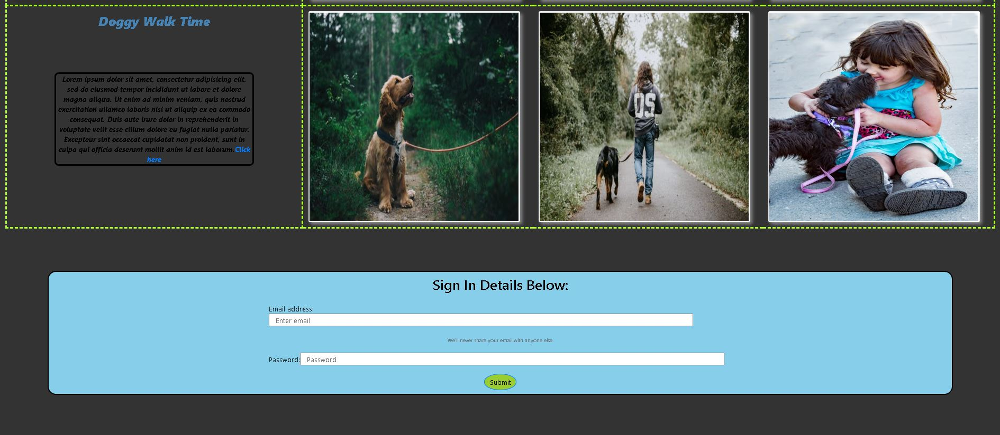

# webpage-css-practice
* Some basic css styles added to my html pages using inline, internal and external styling.
* In this task we'll also make use of Bootstrap for styling.
 

Please note that this web page is not a functional Web Page.

This page purely focuses on CSS styling of a Web Page.

 

This project is one of my first attempts to using css.

The purpose of the page is purely for css styling practice.

## Web Page Example:

## Use of the code for the HTML pages above:

Think of CSS as clothing for a human, it has all to do with style and layout of a Web Page.

In order to use the code, open it via a browser once the files are on your local drive.

In order to edit the code, i'd recommend using text editor like Sublime Text or Visual Studio Code.

Please feel free to make use of the code.

<spam>Happy Coding :sunglasses:

